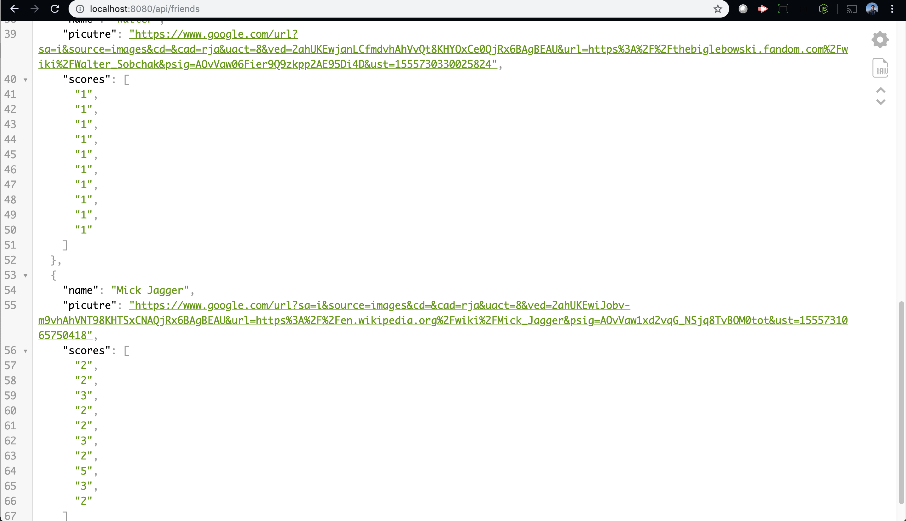
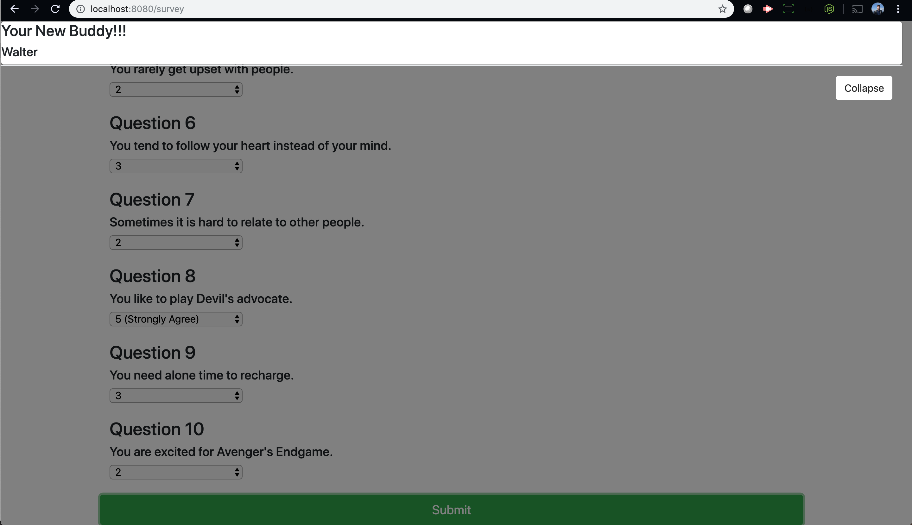

# Friend Finder

### Overview
This survey matches current user's response with other users in an api. This is done by tracking scores and comparing them across the api. A window will then pop up with a name and picture of the person they are matched to.

### Requirments to run
To use this program please use: npm install

Set local port 8080 

### Additional Notes for TA's
For the remainder of the code I was unable to successfully generate the image on the modal. I think it has something to do with the way I was grabbing the links.

 Also I wanted to turn the new scores into int using parse int but I ran out of time because I got stuck early on. I would add this to my for loop.

 parseInt(score[i])

